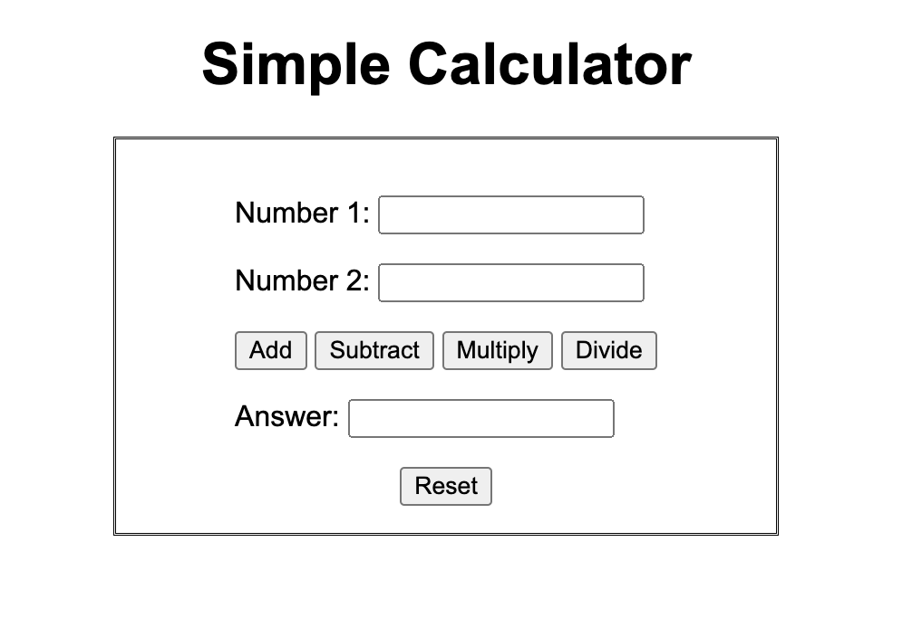

# simple-calculator

Here is a simple calculator created using HTML, CSS and JavaScript. Users can add, subtract, multiply, or divide any number they wish.

https://lookatjla.github.io/simple-calculator/

